# **Moving Probability Trees and an Intro to Markov Chains**

By: Chris Rha

## **Inspiration to the Problem**

In the game Lost Ark, there is an item called an Ability Stone. It has 2 positive traits and 1 negative trait that it can give the player. In order to activate it, the player must facet the stone. A basic ability stone has 6 nodes and every time the player attempts to facet a node, it relies on the current chance of success to facet. The chance of success starts at 75% and every time the player succeeds a facet, the current chance of success goes down 10% and every time the player fails a facet, the current chance of success goes up 10%. The maximum chance of success caps at 75% and the minimum chance of success caps at 25%. If you would like to try to facet and understand the problem better, [here is an example link](https://myar.tistory.com/26). It is in Korean originally but here is a rough translation.

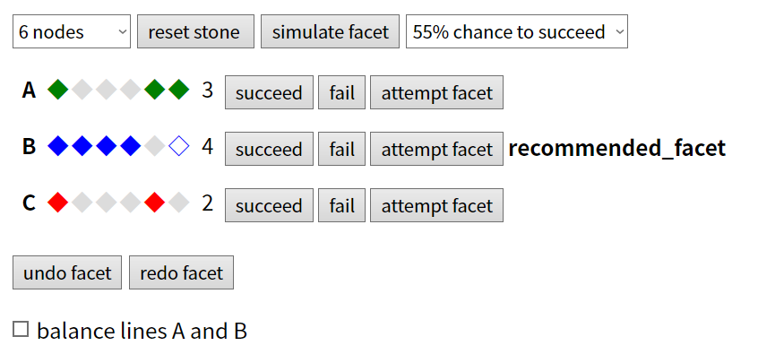

## **Introduction to the Problem**

The main problem I am interested in is how the probability tree changes depending on if the player succeeds or fails a node. An example is seen below.

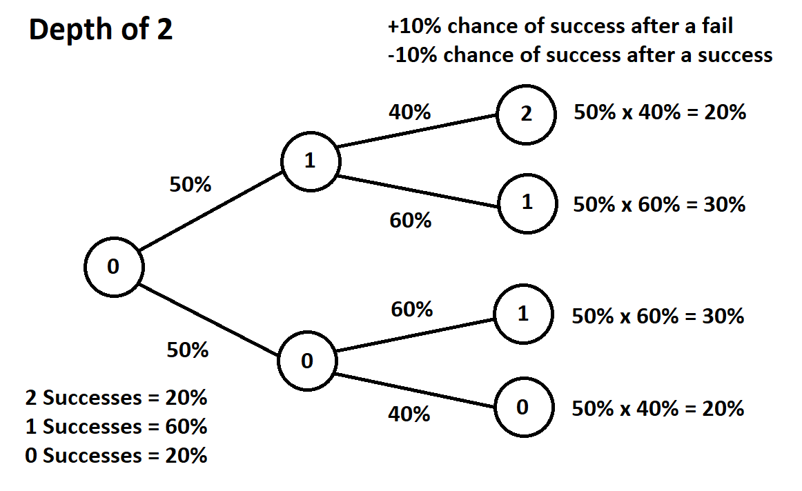

The average amount of successes is easy enough to guess but I want to figure out what is the rate that the standard deviation of successes changes when altering the rate at which the chance of success changes when the player succeeds or fails a facet (ie: predicting the standard deviation when altering the +-10% chance to +-2% or -+15%).

## **Real World Application**

As this problem was inspired by a game mechanic, the game developers might be able to use this work to predict the standard deviation of how many succeeds or failures there will be for an ability stone of X nodes to facet. Being able to predict this will allow the developers to have a better understanding of how powerful the characters might be able to be and adjust the difficulty of the game accordingly for a better player experience. In addition to this, other gaming/gambling systems might use a similar system in the future of which this work can be repurposed.

## **How the Code Works**

We first input these variables: depth, start_percent, max_percent, min_percent, success_change, and failure_change. Depth is how many recursive calls you want to make (ie: how many nodes there are total in the ability stone). Start Percent is the starting success rate that we start faceting at. Max Percent is the maximum success rate chance and Min Percent is the minimum success rate chance. Success Change is added to the Start or Current Percent when a succeed occurs and Failure Change is added to the Start or Current Percent when a failure occurs. If the Success Change is negative and Failure Change is positive, that means we decrease the success odds when we succeed and increase the success odds when we fail. Vice Versa, if the Success Change is positive and Failure Change is negative, that means we increase the success odds when we succeed and decrease the success odds when we fail.

We recursively call the function until depth is equal to 0. Every time we call the function, it calls itself twice, once for a succeed and once for a failure. On succeeds, it multiplies the current success rate times the total probability that it reaches that node to create the new probability that it reaches than node. We also add the succeed change to the current success rate on the succeed call and add the failure change to the current success rate on the failure call.

At the very end when depth is equal to 0, we add the total number of successes achieved and the total probability of achieving that amount of successes to a hashmap as the key and value, respectively. If the current amount of successes already exists in the hashmap, we add that probability to the current probability. Once the recursion is finished, we return the hashmap containing the probability of achieving each amount of possible successes.

## **Output**

Here is the probability distribution given:

Depth = 22

Start Percent = .50

Max Percent = .70

Min Percent = .30

Success Change = -.10

Failure Change = .10

(decreasing the success odds when we succeed and increasing the success odds when we fail)

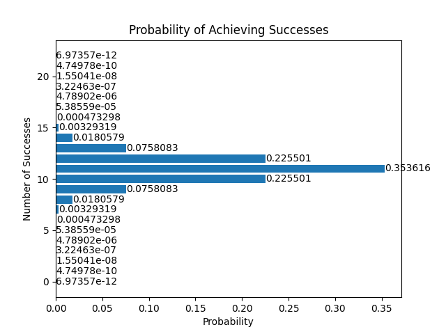

And here it is with the Success and Failure Change variables' signs switched.

(increasing the success odds when we succeed and decreasing the success odds when we fail)

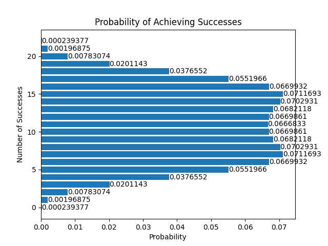

## **Polynomial Regression**

Now that we have the distributions we can calculate the standard deviations. We can use this equation to find the variance and then square root the result.

Var(X) = Σ ( (x-E(x))^2 p(x) )

In order to predict the standard deviation, we first need data to train on. Here, we can set up a for loop that loops from 0% to 50% by 0.1% each step. The other parameters will remain the same for every loop.

Depth = 22

Start Percent = .50

Max Percent = 1.00

Min Percent = 0.00

At the end of every for loop, we append the success and failure rate changes as the key and its standard deviation as the value to a separate hashmap. Here are the points plotted for both the negative success and positive failure rate and the positive success and negative failure rate.

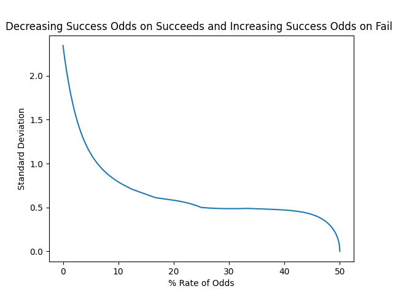

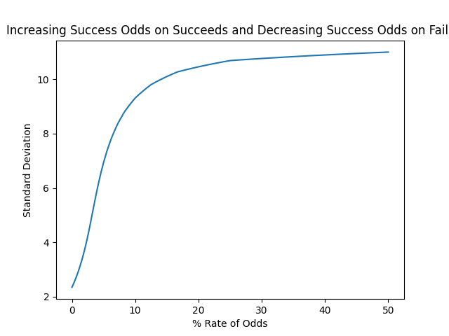

## **Result**

In order to best guess the standard deviation, we can use polynomial regression. Here are the predicted equations for both the negative success and positive failure rate and the positive success and negative failure rate.

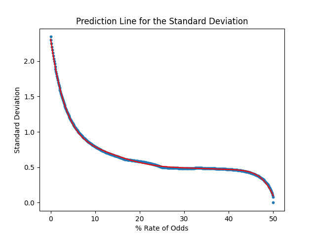

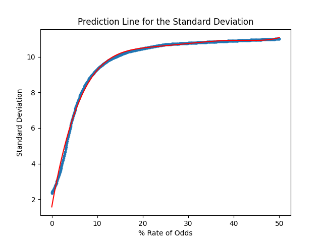

For these given parameters: Depth = 22, Start Percent = .50, Max Percent = 1.00, and Min Percent = 0.00, we get these equations.

y = 2.31063941 + 0*(x^0) + -4.30679862e-01*(x^1) + 5.37685925e-02*(x^2) + -3.86677433e-03*(x^3) + 1.61879859e-04*(x^4) + -3.89449837e-06*(x^5) + 4.99718601e-08*(x^6) + -2.65324207e-10*(x^7)

y = 1.57158274 + 0*(x^0) + 1.45009110e+00*(x^1) + -9.36972359e-02*(x^2) + 2.96263399e-03*(x^3) + -4.37389837e-05*(x^4) + 2.02506517e-07*(x^5) + 7.04086567e-10*(x^6)

I chose a degree of 7 for the first equation and a degree of 6 for the second one because both of those seemed to be the limit right before we start overfitting.

## **Future Work**

It takes a long time to search a depth of 22 (around 3.1 seconds). Repeating that 501 times for each 0.1% step took around 30 minutes! I'd love to see if there is way to calculate the probability of each success using combinatorics but I am not sure there is without severely limiting the scope of the algorithm due to the max and min success chances as well as the possible differing success and failure change rates (if they are not equal to each other when taking the absolute values).

I would also love to see if there a way to speed up the algorithm in general. I wanted to avoid global variables for the max and min success chances and the final returned hashmap because I wondered if it would cause trouble when attempting to deploy on a website.

Thank you for taking the time to read all of this! Please reach out if you have any questions or would like to let me know what other work this repo might be aiding in!

## **Future Work Continued**

I reached out to a few professors about this problem because I was interested in learning more. One of them that responded was Dr. Leonid Koralov, the Professor, Associate Chair for Graduate Studies at the University of Maryland in College Park! The main problem I discussed with him is how to speed up the algorithm as that seemed to be the main limiting factor. At first, I thought this problem would be similar to stochastic processes. In particular, this example by Daniel Jordan seemed nearly identical to mine.

[For example, take a simple random walk. The process starts at 0. There's a 50:50 chance the process goes up or down at each time step. The expected value of the process is always zero, however the variance of the process expands with each step. After 100 steps we expect to be at 0 but we could easily be at 100 (although unlikely).](https://www.quora.com/What-is-a-stochastic-process-What-are-some-real-life-examples)

However, Dr. Koralov pointed me in another direction, to Markov Chains.

## **Markov Chains**

In essence, a [Markov Chain](https://www.youtube.com/watch?v=i3AkTO9HLXo) is graph that shows the percentage chance of an event occuring based on the previous event.

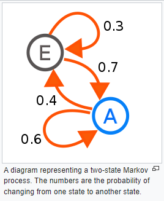

Using this system, we can represent our problem as an [Ergodic Markov Chain](https://people.math.wisc.edu/~valko/courses/331/MC2.pdf) (a Markov Chain in which it is possible to reach every other state from every other single state, ie: no deadends)

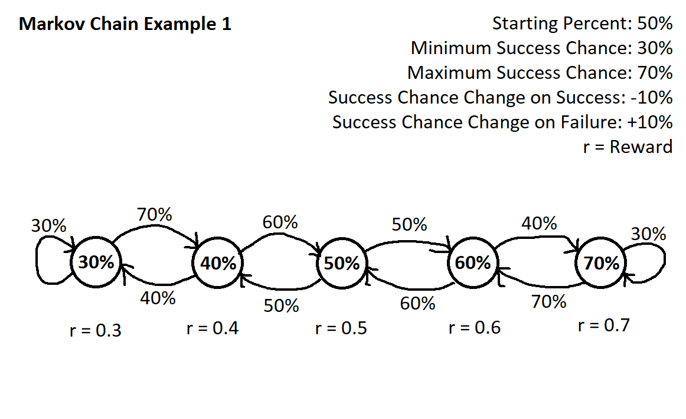

Using this design, we can find the Central Limit Theorem and distribution for any possible parameter for these Moving Probability Trees. One quick thing to change though is that we want the rewards to sum up to 0 so that the reward does not infinitely grow. This is what the proper Ergodic Markov Chain looks like for a particular Moving Probability Tree.

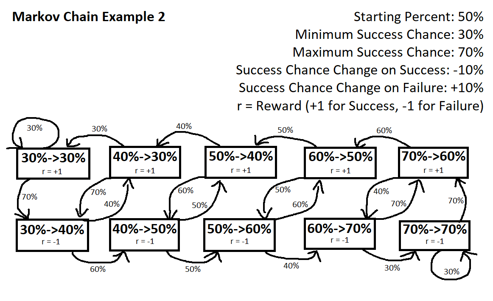

## **Next Steps**

Using this proper Ergodic Markov Chain we can find the [stable state](https://math.stackexchange.com/questions/133214/what-does-the-steady-state-represent-to-a-markov-chain), or, probability distribution of each state occuring. By making an adjacency matrix and plugging it into a [calculator](https://discrete-time-markov.netlify.app), we can find the probability distribution for each state.

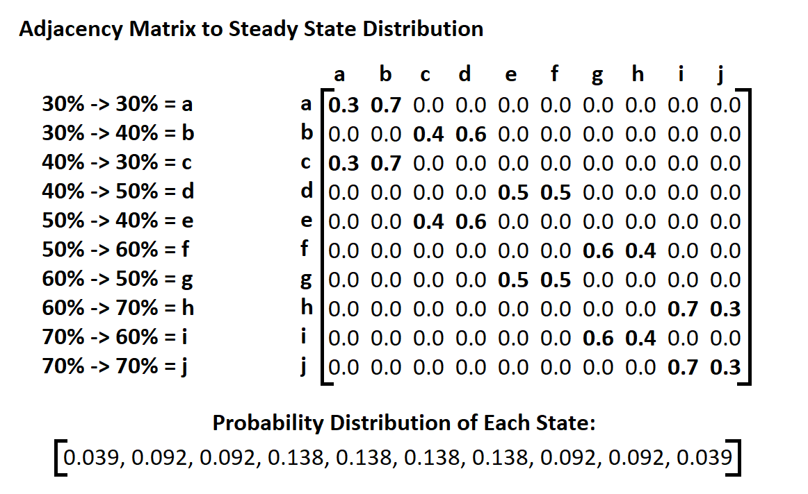

## **Conclusions and Notes**

If you made it this far, thank you for reading! What started out as a simple question turned into a small introduction to Markov Chains. Technically we did not need to make the proper Markov Chain respresentation as it is only really required for finding the Central Limit Theorem as opposed to only finding the stable state. We also could have found the [stationary distribution](https://brilliant.org/wiki/stationary-distributions/) instead of the stable state but I thought that would have taken up too much space (plus I didn't feel like doing it haha). If you haven't seen Markov Chains before I hope you could follow along alright but if not, I linked a video about it above. Thank you again to Dr. Leonid Koralov for taking the time to teach me about Markov Chains and dealing with my endless questions about finding the probability distribution of different Markov Chains.